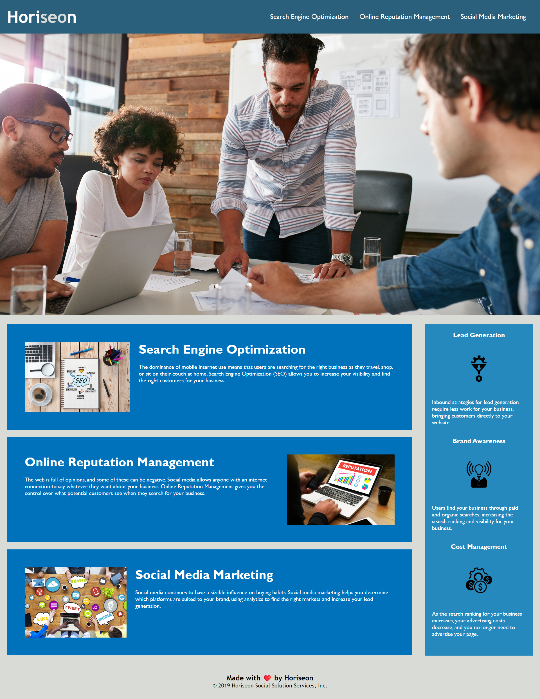

# <c1-horiseon-accesibility>

## Description

This project aims to refactor a marketing agency's existing website to make the site more accessible and to improve Horiseon's position in search engine results. It guarantees that those with impairments can use assistive technologies to view a website. This was done by including alt attributes to images and icons and replacing non semantic elements such as <div> and <span> to appropriate semantic elements.

## Usage

link to deployed application:

https://sunsalio.github.io/c1-horiseon-accesibility/

Screenshot of webpage:

```md
```
  
## License

MIT License

 
